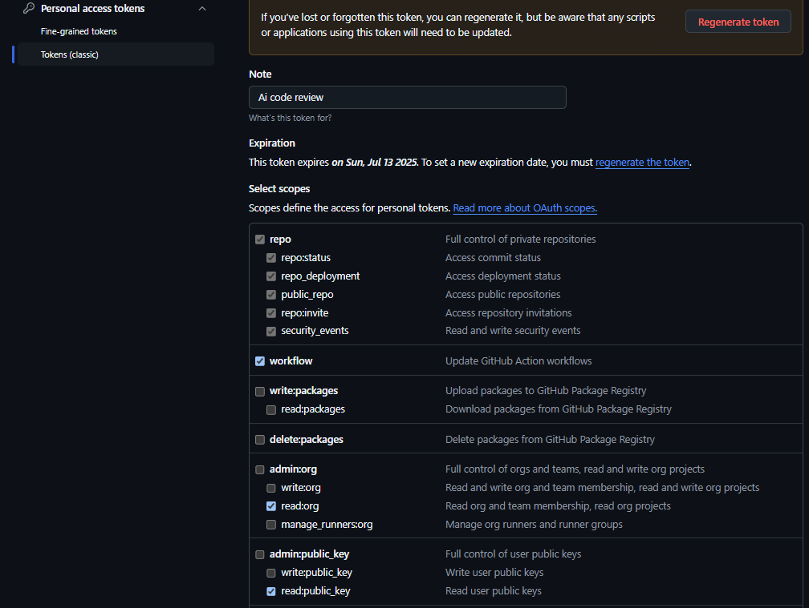
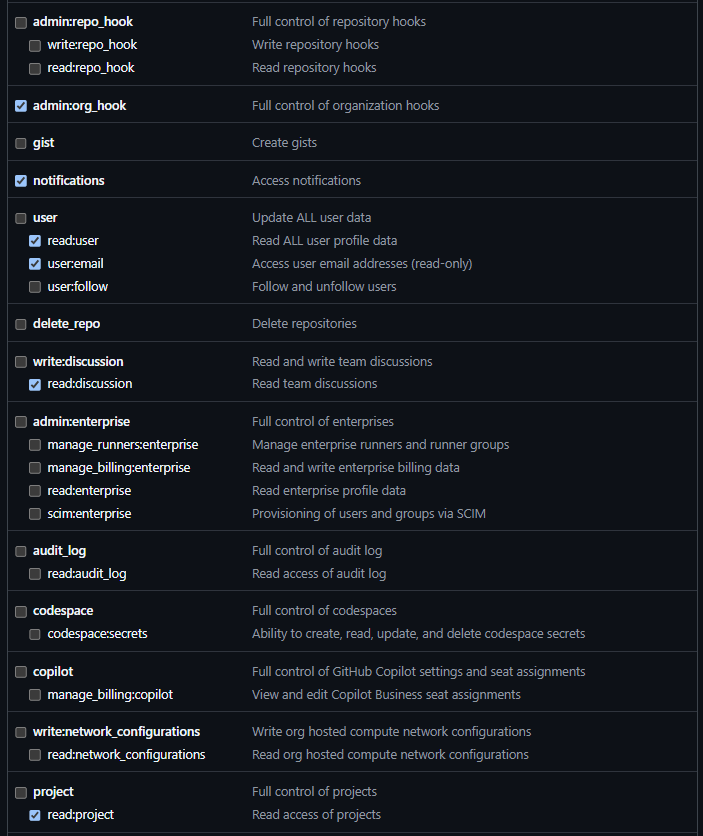
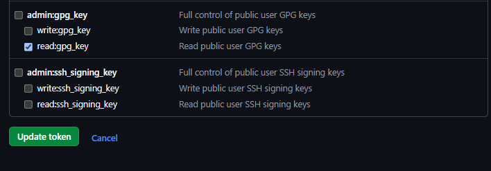

# 🤖 AI Code Review Tool

### This Python-based tool leverages the GitHub API and AI to automate code reviews on pull requests. It enhances the code review process by extracting modified lines, sending them for AI-based analysis, and posting insightful comments and suggestions directly on GitHub PRs.


## Available Versions

The tool is available in multiple versions:

- **V2.1.7 (Latest - SECURITY UPDATE)** - Critical security fixes and 64-bit compatibility
  - 🔒 CRITICAL SECURITY FIX: Removed exposed tokens and enhanced credential handling
  - ✅ Fixed 64-bit compatibility - resolves "Unsupported 16-bit Application" errors
  - 🛡️ Enhanced security with proper .gitignore and credential protection
  - 📖 Updated GitHub token setup guide with step-by-step visual instructions
  - 🔧 Fixed Unicode display issues for better PowerShell compatibility
  - 🎨 Enhanced update notification UI with custom dialogs
  - 📊 Comprehensive usage tracking and administrative features
  - 🤖 Improved AI review quality with targeted feedback
- **V2.1.6** - Previous version (superseded by security update)
- **V2.1.0** - Modern UI with improved features and Claude 4
- **v1.0.1** - Original stable version with core functionality

You can choose which version to run using the version selector script:
```powershell
.\run_ai_review_selector.ps1
```

> **Note:** For detailed documentation, please see the files in the `docs` folder.

---

# 🛠 Installation

### 1️⃣ Prerequisites

- ### Ensure you have the following installed:

# Windows
## Download Python:
- Visit the [official Python website](https://www.python.org/downloads/) and download the latest version of Python 3.8+.
Run the installer. Ensure you check the box that says "Add Python to PATH" during installation.

## Install pip:

- Pip is automatically installed with Python 3.8+. You can verify the installation by opening Command Prompt and typing:
```
python --version
```
```
pip --version
```

- If pip is not installed, you can manually install it by downloading the get-pip.py script from here and running:
```
python get-pip.py
```
### ⚠️ NOTE : Install pyinstaller and run this if any changes made in the code logic:

```
pip install pyinstaller
```
```
pyinstaller --onefile .\AIReview.py
```

- ### Install PyGitHub 

```
pip install PyGithub requests
```

### 2️⃣ Get the Open Arena token

- #### Please refer 👉 [Open Arena Link](https://helix.thomsonreuters.com/static-sites/site-builds/gcs-ml_ai-platform-documentation/ai-platform/09_openarena/api_user_guide.html#step-5-locate-your-esso-token)


### 3️⃣ Create Github Token
#### Generate a GitHub Token:
- Navigate to the developer settings on GitHub and create a token. Please choose the "Classic token" option.

#### Follow These Steps (Visual Guide):

**Step 1: Access Developer Settings**


**Step 2: Create Personal Access Token**


**Step 3: Configure Token Permissions**


#### Ensure the Following Options are Selected:
- ✅ **repo** (Full control of private repositories)
- ✅ **write:discussion** (Write access to team discussions)  
- ✅ **read:discussion** (Read access to team discussions)
- ✅ **write:packages** (Write packages to GitHub Package Registry)
- ✅ **read:packages** (Read packages from GitHub Package Registry)

---

# ⚙️ Configuration

### ❗ Before running the tool, make sure you have:

- GitHub Token: For authentication with the GitHub API

- OpenArena Token: To send modified code for AI-based review

- These credentials must be entered when prompted in the GUI.

---
# 🚀 Usage

### 1. Running the Tool:
- You can find the executable (.exe) for the tool in the **dist folder**. See the examples below:


### 2. Enter the required details in the GUI:

- GitHub Token

- OpenArena Token

- Repository Name (e.g., username/repo)

- Pull Request Number


### 3. Click "Run Code Review" to initiate the process.


### 4. AI-generated comments will be posted directly on the PR.


### 5. Check your PR on GitHub to view the feedback.

---

# 📌 Features

- ✅ Extracts exact modified lines from PR patches
- ✅ Sends changes to OpenArena AI for review
- ✅ Analyzes logic impact, potential issues, and code consistency
- ✅ Posts AI-generated comments on GitHub PR
- ✅ Displays progress and results in a simple Tkinter GUI


---

# 🛠 Troubleshooting

- 🔹 Error: Authentication failed – Ensure your GitHub token has the correct permissions.
- 🔹 Error: AI review failed – Check your OpenArena API token and internet connection.
- 🔹 Comments not appearing on PR? – Verify that the PR number and repository name are correct.
- 🔹 Error: "Unsupported 16-bit Application" – Download the latest v2.1.6 64-bit version from releases.

## 🔐 Security Notice

⚠️ **IMPORTANT**: This tool uses encrypted local storage for your tokens. Your credentials are:
- **Encrypted** before being saved locally
- **Never transmitted** except to GitHub/OpenArena APIs
- **Automatically cleared** when you uninstall the tool

**Never share your tokens or .exe files that might contain cached credentials.**

For any issues, feel free to open an issue in the repo.

---

# 🏆 Credits

### Developed by the Ultratax Team, 2025.
- **Kalyani, Kandunuri**
- **Harish Sarma, Velavalapalli**

- Speacial thanks to **Radhika Ramagiri** and **Prasad Kolaparthi** 💖

---

# 📚 Resources Used
- GitHub API Documentation: For understanding how to interact with GitHub programmatically.
- OpenArena API Documentation: For integrating AI-based code analysis.
- Python Official Documentation: For language-specific features and libraries.
- Custom Tkinter Documentation: For creating the GUI interface.
- PyGitHub Documentation: For utilizing GitHub API features.
